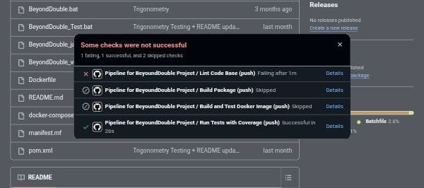

# Answers - Software Quality Exam

## Part 1 - Strategy

### 1. Difference between CI and CD

**CI (Continuous Integration)** is a development practice where developers frequently merge code changes into a central repository, after which automated builds and tests are run. The main goals are to find bugs quickly and improve software quality.

**CD (Continuous Deployment/Delivery)** is an extension of CI that automatically deploys the code to production/staging environments after passing all tests. Continuous Delivery requires manual approval for deployment, while Continuous Deployment is fully automated.

### 2. Selected Tools Justification

- **Language**: Java
- **Linter**: Checkstyle
- **Coverage Tool**: JaCoCo (Java Code Coverage)

**Justification**: 
- Checkstyle is widely adopted in Java ecosystems and integrates seamlessly with Maven
- JaCoCo is the standard coverage tool for Java projects with excellent Maven integration
- Both tools are mature, well-documented, and specifically designed for Java projects

### 3. Coverage Threshold

**Selected threshold**: 90%

**Justification**: 
- 90% provides a balanced approach between code quality and practical development
- It's high enough to ensure most critical paths are tested
- It's achievable without being overly restrictive for complex business logic
- Industry standard for many enterprise Java projects

## Part 4 - Validation and Logs

### Identifying Failures in Logs

**Linter Failures**:
- Look for "Checkstyle" violations in logs
- Error messages show file names and line numbers with style violations
- Build fails with "Checkstyle goal failed" message

**Test Failures**:
- Maven Surefire plugin reports "Tests run: X, Failures: Y, Errors: Z"
- Failed test names and stack traces are displayed
- Build fails with "There are test failures" message

**Coverage Failures**:
- JaCoCo reports "Coverage checks have not been met"
- Shows actual vs required coverage percentages
- Failed rules are listed with specific coverage metrics

### Successful vs Failed Run Differences

**Successful Run**:
- All steps show green checkmarks ✓
- "BUILD SUCCESS" message at the end
- All tests pass with expected coverage
- No Checkstyle violations reported

**Failed Run**:
- Red X marks on failed steps ❌
- "BUILD FAILURE" message
- Workflow stops at the first failing step
- Detailed error messages indicate the specific failure reason

## Part 5 - AI and Ethics

### AI-Generated Code Detection Methods

1. **Watermarking Detection**: Some AI models embed statistical patterns in generated code that can be detected by specialized tools.

2. **Code Style Analysis**: Tools that analyze coding patterns, variable naming conventions, and structural consistency to identify AI-generated code that lacks personal coding style.

### Why 100% Authorship Cannot Be Guaranteed

- AI models are trained on human-written code, making detection challenging
- Students can modify AI-generated code to bypass detection
- Current detection tools have false positives/negatives
- The line between "assistance" and "generation" is blurry
- Code can be rewritten multiple times to obscure origins

### Reasonable AI Usage Policies in Education

1. **Transparency Policy**: Require disclosure of AI tool usage in assignments
2. **Educational Purpose**: Allow AI for learning concepts but not for completing assignments
3. **Limited Usage**: Permit AI for specific tasks like debugging or documentation
4. **Assessment Adaptation**: Design assignments that require personal creativity and problem-solving
5. **Skill Verification**: Include oral exams or live coding sessions to verify understanding
